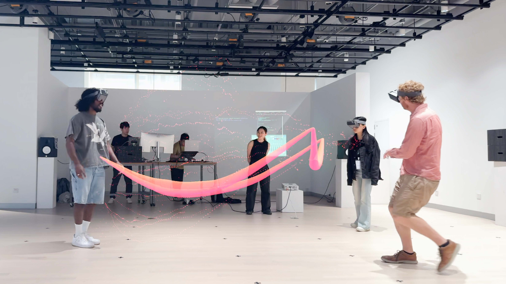
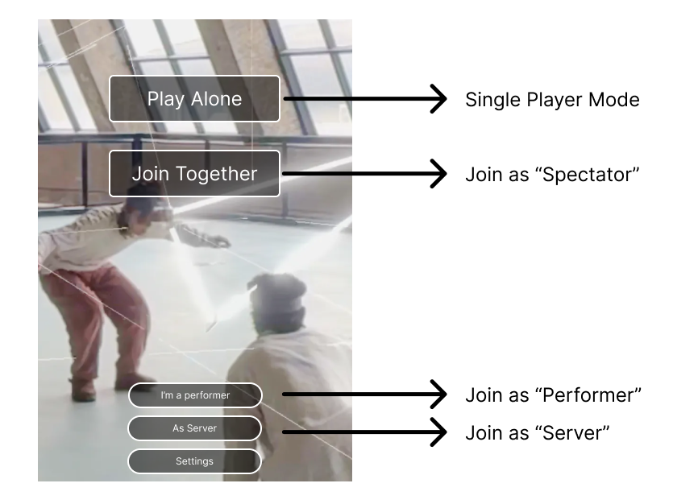
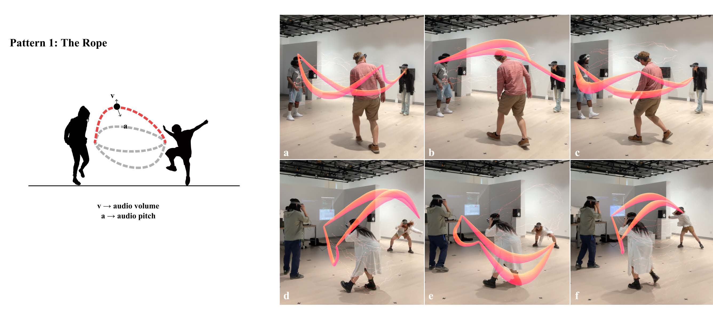
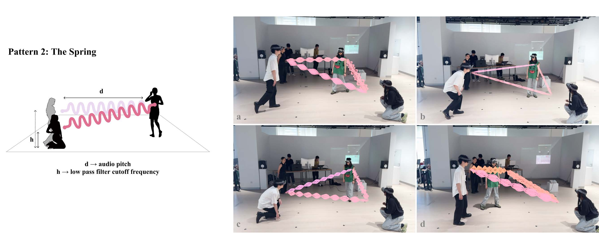
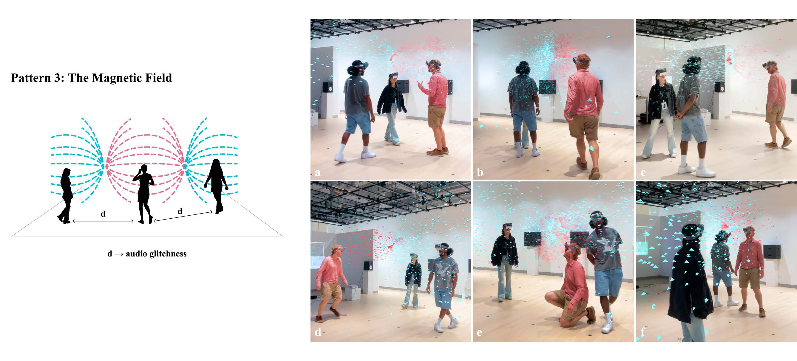
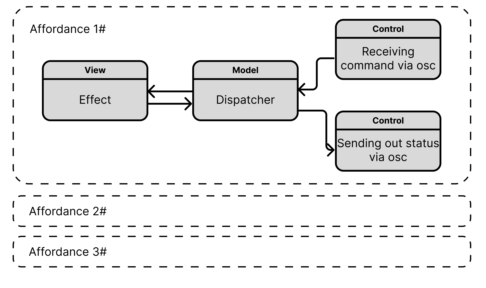

# GravField
GravField (short for "Gravitational Field") is an experimental and participatory inter-bodily live-coding performance system within a collocated mixed reality. This WiP aims to explore the vast potential of intercorporeal signals, creating a communicative, playful, and co-creative space where players’ interconnected bodies become the instruments of expression.

# How to play
## 1. Choose Role

- ### Single Player Mode
  Click "Play Alone" to preview the effects

- ### Multiple Player Mode
  - **Server: To become the server, click "As Server". Only one server is required for game to play.**
  Since GravField involves multiple parties in a networked application, a separate device is required to act as the server. There are two ways to operate as the server:
    - **Run the application in Unity Editor**. Through this way,server will have full functionality.
    - **Run the iOS app as the server**. Through this way, server will lack the Live-coding System and Live Sound System subsystems, but it can still receive OSC control commands.
     
  - **Performer: Join game as performer, click "I'm a performer". A maximum of 3 performers are allowed to join.**
  Triggers effects and participates in the performance. The performance content will be visible to everyone.
   
  - **Spectator: Join game as spectator, click "Join Together".**
  Observes as a spectator, freely navigating the world to view the visual content created by performers.

## 2. Play with affordances
GravField now has 3 types of affordances available. They are ***Rope***, ***Spring*** and ***Magnetic Field***. Affordance can be switched by server.

# Unity Project for GravField
## System Requirement:
Unity Version: 2022.3.20 or above  
Start Scene: Assets/Scenes/GravField

## Structure

The project is designed according to the MVC pattern. Each effect can have a dispatcher to receive command or send out status. Thus, the entire system consists of three sub-systems: 
- **Content System** 
  Responsible for synchronous display and triggering of effects.
- **Live-controlling System** 
  Enables real-time control of Unity Server, we implemented a live-coding system using Coda.js. *Please refer to respective repository for its setup instructions.*
- **Live sound System** 
  Transmits performer's body signals to audio software via Unity Server to control sound variations. We implemented a sound system using LIVE. *Please refer to respective repository for its setup instructions.*

> Each system operates independently, and you can also choose to run other softwares or not to run one of them. To experience the complete process, you need to configure their local network addresses.

## Network Configuration
Due to the complexity of GravField as a networked system, there are many network addresses that need to be configured.

 

### Configuration for Content System:
- **To change Default Server IP** 
  Find "ConnectionManager" in Editor scene, modify "Server IP" in inspector.

 

- **To change Server IP when playing** 
  Go to "Settings" in the app, modify "Server IP", press Enter.

 

### Configuration for Middleware System:
Folder: Assets/Scenes/GravField_Infrastructure/Assets

- **UDP from Coda:**  
  File: OscConnectionReceiverFromCoda 
  Default IP: 127.0.0.1, Port: 13600  
- **UDP to Coda:**  
  File: OscConnectionSenderToCoda 
  Default IP: 127.0.0.1,  Port: 13500  
- **UDP to Live:**  
  File: OscConnectionSenderToLive 
  Default IP: 192.168.0.136,  Port: 7000

## For Testing
### Solo Mode:
  If you don't have people around you to test, you can enable Solo Mode. In Solo mode, it will play a video in which 3 performers are dancing and send you osc signals at the same time.

> **To enable Solo mode, press "s" before server starts. Please note that server will automatically start after 5 seconds if there's no input.**

### ShortCut:
- F5: Toggle Panel of parameters sent to Live 
- F6: Toggle Panel of parameters received from Coda
- F8: Toggle Info Panel
- Alpha 1: Chane to "Chain" Mode
- Alpha 2: Chane to "Spring" Mode
- Alpha 3: Chane to "Magmetic" Mode
